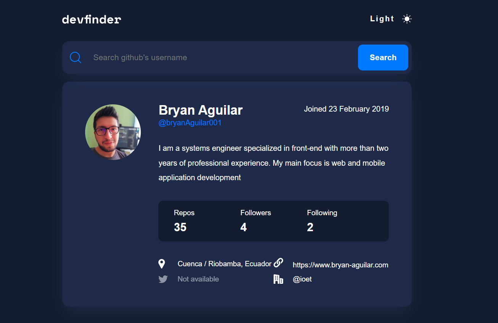

# [Frontend Mentor - Github User Search App](https://github-user-search-challenge.vercel.app/)

This is a solution to the [GitHub user search app challenge on Frontend Mentor](https://www.frontendmentor.io/challenges/github-user-search-app-Q09YOgaH6). In this project, you'll use the GitHub users API to pull profile data and display it. It's a great challenge if you're looking to practice working with a 3rd-party API.

## Description

This project presents the construction of a simgle app built from scratch using React + Vite + Typescript.

## Installation

This React project has been created using [Vite](https://vitejs.dev/guide/).

Step 1:

You need to install yarn. Yarn is a package and library manager.

Step 2:

```bash
git clone https://github.com/bryanAguilar001/github-user-search-challenge.git
cd github-user-search-app
```

Step 3:

Run this command to install libs

```bash
yarn
```

Step 4:

Run the app

```bash
yarn run start
```

### Links

- Solution URL: [Github Searh App](https://github-user-search-challenge.vercel.app/)

## My process

### Built with

- React JS 18
- Typescript
- Styled Components
- Github Api

## Author

- Website - [www.bryan-aguilar.com](https://www.bryan-aguilar.com/)
- Medium - [baguilar6174](https://baguilar6174.medium.com/)
- LinkeIn - [baguilar6174](https://www.linkedin.com/in/baguilar6174)

## Contributing

Pull requests are welcome. For major changes, please open an issue first to discuss what you would like to change.

## Github User Search


